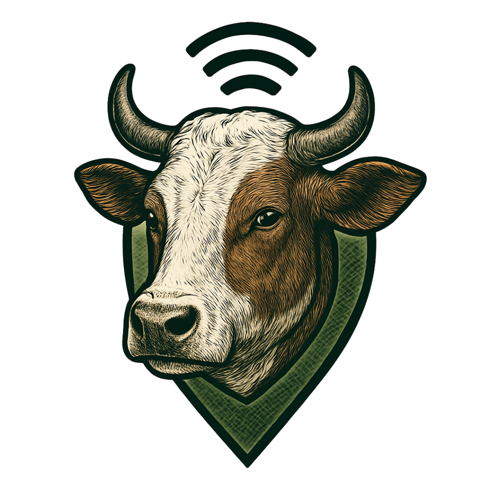

  

## 👋 Bem-vindo à Moovox

A **Moovox** é uma solução de tecnologia rural desenvolvida por estudantes da ETEC Bento Quirino, com foco em pequenos produtores. Nossa missão é transformar a gestão do campo com inovação, conectando tecnologia à pecuária de forma acessível e eficiente.

### 🐄 Plataforma inteligente de gestão de rebanho
- 📍 Telemetria e geolocalização de animais
- 💉 Controle de vacinação automatizado
- 📊 Painel web intuitivo e centralizado

### 🛠️ Tecnologias
A Moovox passou por uma evolução tecnológica:
- **Frontend:** React + TailwindCSS
- **Backend:** Node.js + MariaDB
- **Arquitetura:** RESTful + MVC

---

🌾 *Inovação para o campo começa aqui.*
